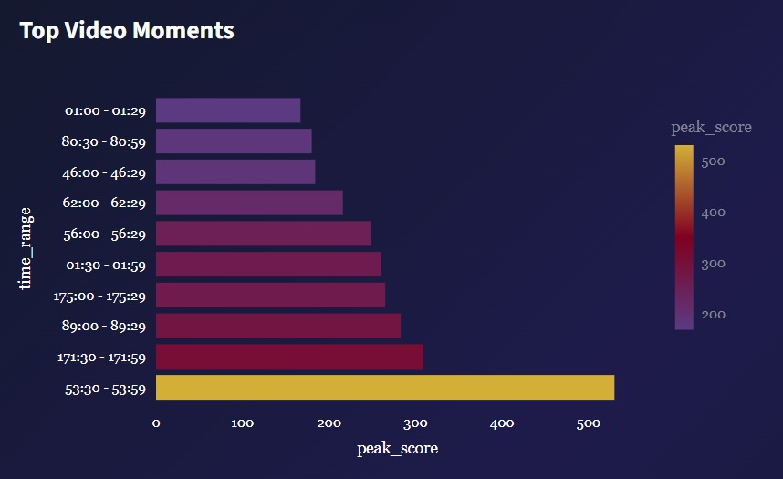
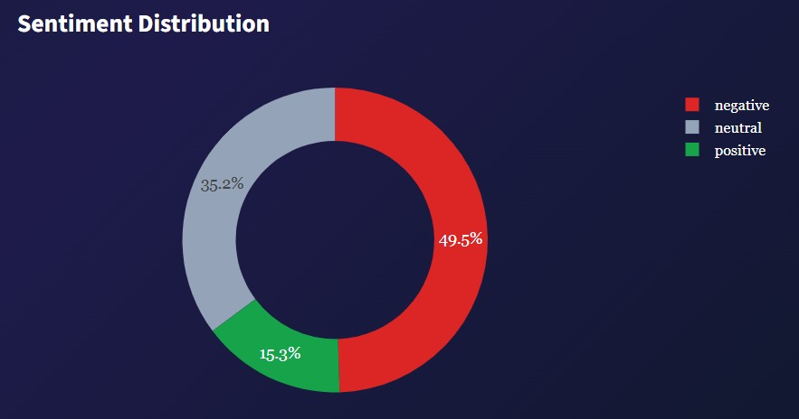
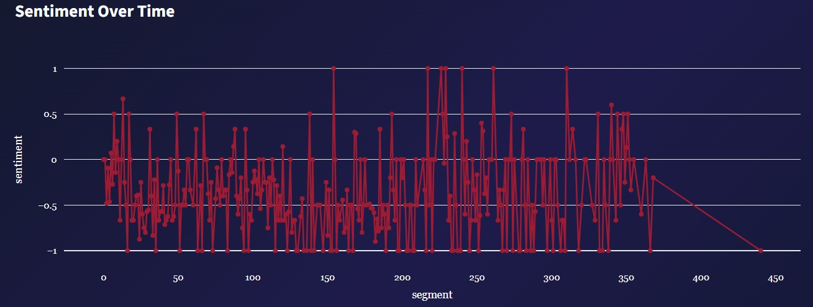
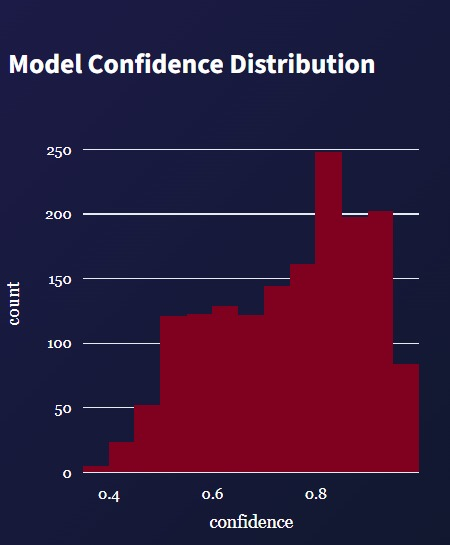
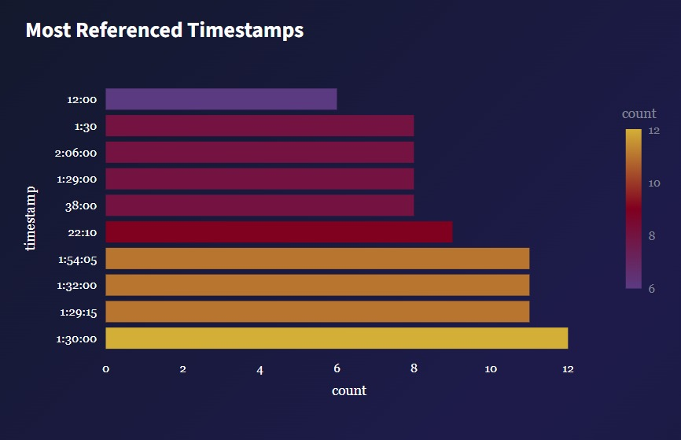
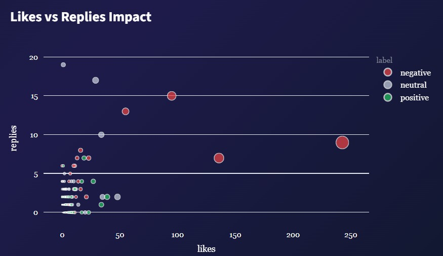
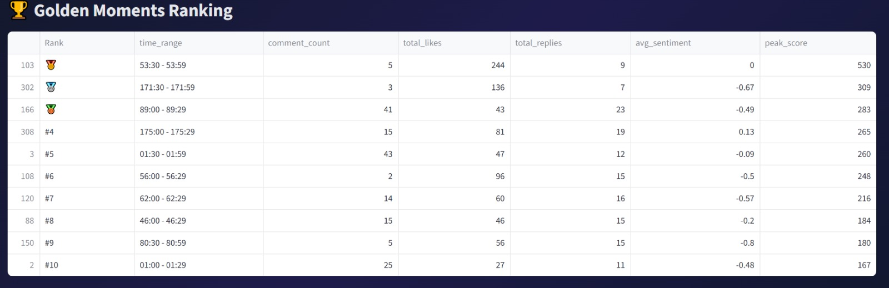
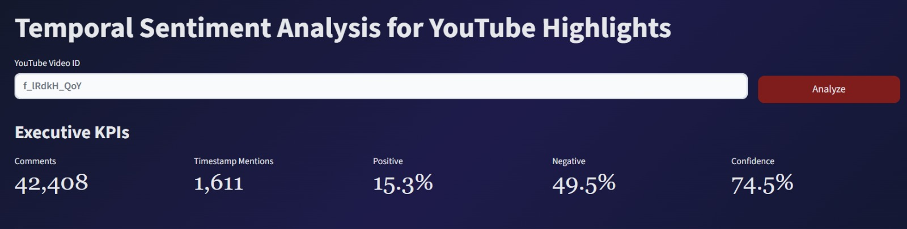

# Temporal Sentiment Analysis for YouTube Highlights

---

# Title Page & Authors

## Temporal Sentiment Analysis for YouTube Highlights

### Authors

- Faris Ayman – 202210206


### Supervised by

Husam Barham

### Course

20252 – Graduation Project

### Semester

second Semester, 2025/2026

### Submission Date

[8\6\2026]

---

# Table of Contents

1. [Abstract](#abstract)
2. [Acknowledgment](#acknowledgment)
3. [Business Intelligence Project Description and Objectives](#business-intelligence-project-description-and-objectives)
4. [Data Research and Acquiring Effort](#data-research-and-acquiring-effort)
5. [Data Description and Understanding](#data-description-and-understanding)
6. [Data Primary Cleaning and Transformation](#data-primary-cleaning-and-transformation)
7. [Data Visualization and Insights](#data-visualization-and-insights)
8. [Dashboard Design & Business Insights](#dashboard-design--business-insights)
9. [Advanced Analytics and AI Modeling](#advanced-analytics-and-ai-modeling)
10. [Tools Research and Selection Effort](#tools-research-and-selection-effort)
11. [Project Deployment Effort – Use Case](#project-deployment-effort--use-case)
12. [Results](#results)
13. [Limitations](#limitations)
14. [Future Work](#future-work)
15. [References](#references)
16. [Code Setup and Dependencies](#code-setup-and-dependencies)

---

# Abstract

The rapid growth of online video content has generated massive volumes of audience feedback in the form of comments, reactions, and discussions. While platforms such as YouTube provide traditional engagement metrics including views, likes, and watch time, they often fail to reveal which exact moments within a video captured audience attention and generated strong emotional responses. This project addresses this limitation by developing a Business Intelligence and Artificial Intelligence solution capable of identifying significant moments in YouTube videos through timestamp-based comment analysis.

The proposed system collects YouTube comments using the YouTube Data API v3, extracts timestamp references through pattern matching techniques, and performs sentiment analysis using a transformer-based Natural Language Processing model. Timestamp comments are grouped into temporal segments, enriched with engagement indicators such as likes and replies, and analyzed using a custom highlight-ranking algorithm. The processed data is presented through an interactive Streamlit dashboard designed to support exploratory analysis and decision making.

The results demonstrate that timestamp comments can serve as valuable indicators of audience attention and engagement. By combining sentiment analysis, engagement metrics, and temporal analytics, the system successfully identifies video highlights, measures audience reactions, and transforms unstructured social media data into actionable business insights. The developed solution provides value for content creators, digital marketers, media analysts, and researchers seeking a deeper understanding of audience behavior.

---

# Acknowledgment

We would like to express our sincere gratitude to our supervisor, **[Supervisor Name]**, for the continuous guidance, encouragement, and valuable feedback provided throughout the development of this graduation project.

We also extend our appreciation to the faculty members of the Computer Information Systems Department for the knowledge and support they provided during our academic journey. Their contributions have played a significant role in the successful completion of this work.

Finally, we would like to acknowledge Google for providing access to the YouTube Data API and the open-source community whose tools, libraries, and machine learning models made the implementation of this project possible.

---

# Business Intelligence Project Description and Objectives

## Project Description

Temporal Sentiment Analysis for YouTube Highlights is a Business Intelligence and Artificial Intelligence solution designed to analyze audience reactions and automatically identify the most engaging moments within YouTube videos.

The system leverages timestamp references embedded within audience comments to determine which moments viewers consider important, memorable, entertaining, educational, or controversial. These timestamp references are combined with sentiment analysis and engagement metrics to generate meaningful insights about audience behavior.

Unlike traditional analytics platforms that focus primarily on aggregate metrics such as views and watch time, this project provides moment-level intelligence by identifying the exact segments that generate audience attention and emotional reactions.

---

## Industry Domain

This project operates within several domains:

- Digital Media Analytics
- Social Media Intelligence
- Content Creation and Management
- Digital Marketing
- Business Intelligence
- Audience Behavior Analysis

---

## Business Problem

Content creators and organizations frequently receive thousands of comments on popular videos. Manually analyzing these comments presents several challenges:

- Significant time and effort are required.
- Important audience feedback can be overlooked.
- It is difficult to identify which moments generated the strongest reactions.
- Emotional responses are not easily measurable.
- Traditional analytics tools provide limited insight into moment-level engagement.

As a result, creators often struggle to understand which parts of their content resonate most strongly with viewers.

---

## Proposed Solution

The proposed solution automatically:

1. Collects comments from YouTube videos.
2. Detects timestamp references within comments.
3. Performs sentiment analysis on timestamp-related comments.
4. Measures engagement through likes and replies.
5. Groups reactions into temporal segments.
6. Calculates highlight scores for each segment.
7. Visualizes insights through an interactive dashboard.

---

## Project Objectives

The primary objectives of this project are:

### Objective 1: Timestamp Detection

Automatically extract timestamp references from audience comments.

### Objective 2: Audience Sentiment Analysis

Determine whether audience reactions are positive, neutral, or negative.

### Objective 3: Highlight Discovery

Identify the most engaging moments within a video.

### Objective 4: Engagement Measurement

Measure audience interaction through likes and replies.

### Objective 5: Business Intelligence Dashboard

Provide decision-makers with clear and interactive visualizations.

### Objective 6: Audience Behavior Understanding

Generate insights that help creators understand audience interests, preferences, and reactions.

---

## Expected Business Value

The developed system provides value for multiple stakeholders.

### Content Creators

- Discover video highlights automatically.
- Understand audience preferences.
- Improve future content strategy.

### Marketing Teams

- Identify highly engaging moments.
- Measure audience reactions to campaigns.

### Researchers

- Study collective audience behavior.
- Analyze sentiment patterns across content.

### Media Organizations

- Monitor public reaction to published content.
- Evaluate audience satisfaction and engagement.

---

## Success Criteria

The project is considered successful if it can:

- Accurately extract timestamp references.
- Correctly classify audience sentiment.
- Identify meaningful video highlights.
- Provide intuitive visualizations.
- Generate actionable Business Intelligence insights.

---


## Success Criteria

The project is considered successful if it can:

- Accurately extract timestamp references.
- Correctly classify audience sentiment.
- Identify meaningful video highlights.
- Provide intuitive visualizations.
- Generate actionable Business Intelligence insights.

---


# Data Research and Acquiring Effort

## Data Requirements Analysis

Before implementation, an analysis was conducted to determine the type of data required to achieve the project's objectives.

The project aims to identify important moments within YouTube videos based on audience reactions. Therefore, the required data needed to satisfy three conditions:

1. Represent genuine audience behavior.
2. Contain references to specific moments within videos.
3. Include measurable engagement indicators.

Based on these requirements, YouTube comments were selected as the primary data source.

---

## Why YouTube Comments?

YouTube comments provide valuable audience-generated feedback because viewers frequently:

- Express opinions about content.
- React emotionally to specific events.
- Discuss memorable moments.
- Reference exact timestamps within videos.

For example:

```text
3:45 was hilarious!
```

```text
12:18 changed everything.
```

```text
8:52 is the best part of the video.
```

These timestamp references act as natural indicators of audience attention and can be leveraged to discover video highlights.

---

## Data Source

### Primary Source

YouTube Data API v3

The YouTube Data API v3 was selected as the primary data acquisition source because it provides official access to YouTube content and metadata.

Source URL:

https://developers.google.com/youtube/v3

---

## Why the YouTube Data API?

Several alternative approaches were considered.

| Method | Advantages | Limitations |
|----------|----------|----------|
| Web Scraping | Flexible | Fragile and may violate platform policies |
| Third-Party Datasets | Easy access | Limited availability and outdated content |
| YouTube API | Official, reliable, structured | Requires API configuration |

The YouTube Data API was selected because it:

- Provides official access to YouTube data.
- Returns structured JSON responses.
- Supports large-scale comment retrieval.
- Is actively maintained by Google.
- Complies with platform policies.

---

## Data Acquisition Process

The acquisition workflow follows the sequence below.

### Step 1: Video Selection

A user provides a YouTube Video ID through the Streamlit dashboard.

Example:

```text
f_lRdkH_QoY
```

---

### Step 2: API Authentication

The application authenticates requests using a Google API key stored securely within an environment variable.

Example:

```python
API_KEY = os.getenv("YOUTUBE_API_KEY")
```

---

### Step 3: Comment Collection

The system requests comment threads through the YouTube API.

Retrieved information includes:

- Comment text
- Like count
- Reply count
- Publication date

---

### Step 4: Pagination Handling

Many YouTube videos contain hundreds or thousands of comments.

The system automatically handles API pagination to retrieve all available comment pages.

This ensures a comprehensive dataset rather than a limited sample.

---

## Raw Dataset Structure

The initial dataset contains the following attributes.

| Attribute | Description |
|------------|------------|
| comment | Original comment text |
| likes | Number of likes |
| replies | Number of replies |
| date | Publication date |

Example:

| comment | likes | replies | date |
|----------|----------|----------|----------|
| 3:45 was amazing | 45 | 3 | 05/10/2026 |

---

## Data Acquisition Challenges

Several challenges were encountered during collection.

### Challenge 1: API Quotas

The YouTube API imposes daily request limits.

Solution:

Efficient pagination and optimized requests were used to minimize API consumption.

---

### Challenge 2: Timestamp Variability

Users express timestamps using multiple formats.

Examples:

```text
1:20
```

```text
12:45
```

```text
01:15:30
```

Solution:

A regular-expression pattern was developed to detect multiple timestamp formats.

---

### Challenge 3: Non-Relevant Comments

Many comments do not contain timestamps.

Examples:

```text
Great video!
```

```text
Thanks for uploading.
```

Solution:

Comments without timestamps are excluded from temporal analysis.

---

## Data Acquisition Outcome

The acquisition process successfully generates a real-world dataset consisting of:

- Audience comments
- Engagement metrics
- Timestamp references
- Sentiment predictions
- Temporal video segments

Unlike projects relying on static datasets, this solution acquires live data directly from YouTube, allowing analysis of any public video selected by the user.

---

# Data Description and Understanding

## Data Dictionary

The following table describes the attributes used throughout the analysis pipeline.

| Field | Description | Business Importance |
|---------|---------|---------|
| comment | Original YouTube comment | Captures audience feedback |
| likes | Number of likes | Indicates audience agreement |
| replies | Number of replies | Measures discussion intensity |
| date | Comment publication date | Supports temporal analysis |
| timestamp | Extracted timestamp | Links comments to video moments |
| seconds | Timestamp converted to seconds | Enables mathematical processing |
| clean_comment | Cleaned comment text | Input to sentiment model |
| label | Sentiment prediction | Measures audience emotion |
| confidence | Model confidence score | Indicates prediction certainty |
| sentiment_score | Numerical sentiment value | Enables aggregation |
| segment | 30-second interval | Groups related comments |
| weight | Engagement score | Measures influence |
| peak_score | Highlight ranking score | Identifies important moments |

---

## Exploratory Data Analysis (EDA)

Exploratory Data Analysis was performed to understand audience behavior before generating final insights.

The analysis focused on three key dimensions:

### Audience Attention

Measured through timestamp frequency.

### Audience Engagement

Measured through likes and replies.

### Audience Sentiment

Measured through AI-generated sentiment predictions.

---

## Key Patterns Observed

Several recurring patterns emerged during analysis.

### Pattern 1: Audience Clustering

Timestamp comments tend to cluster around a small number of video moments.

This indicates that viewers naturally identify important events.

---

### Pattern 2: Engagement Concentration

A small percentage of comments receive the majority of likes and replies.

This suggests that certain comments strongly resonate with the audience.

---

### Pattern 3: Sentiment Peaks

Emotionally charged moments generate larger sentiment fluctuations.

Both highly positive and highly negative moments receive increased audience attention.

---

### Pattern 4: Highlight Reinforcement

When a timestamp receives:

- Many mentions
- Many likes
- Many replies

it often corresponds to a meaningful event within the video.

This observation supports the project's highlight-ranking methodology.

---

## Business Insights Derived from EDA

The exploratory analysis produced several insights.

### Insight 1

Timestamp comments provide a reliable signal for identifying audience-selected highlights.

### Insight 2

Engagement metrics help distinguish meaningful highlights from random mentions.

### Insight 3

Sentiment analysis adds emotional context to audience attention.

### Insight 4

Combining attention, engagement, and sentiment produces more informative insights than using any individual metric alone.

---

# Data Primary Cleaning and Transformation

## Overview

Raw YouTube comments cannot be analyzed directly.

Several preprocessing and transformation stages were applied to prepare the data for sentiment analysis and highlight detection.

---

## Step 1: Timestamp Extraction

Timestamp references were extracted using Regular Expressions.

Supported formats include:

```text
1:25
12:45
01:15:30
```

Purpose:

Link audience comments to exact video moments.

---

## Step 2: Timestamp Validation

Certain time-like patterns may not represent video timestamps.

Examples include:

```text
5:30 PM
```

```text
8:00 AM
```

Such values are excluded to prevent false detections.

---

## Step 3: Missing Timestamp Removal

Comments without timestamps are removed from temporal analysis.

Reason:

The project focuses specifically on identifying reactions associated with video moments.

---

## Step 4: Timestamp Conversion

All timestamps are converted into seconds.

Example:

| Timestamp | Seconds |
|------------|------------|
| 1:30 | 90 |
| 2:15 | 135 |
| 1:05:30 | 3930 |

Purpose:

Enable mathematical calculations and segment generation.

---

## Step 5: Text Cleaning

Cleaning operations include:

- Lowercasing
- URL removal
- Timestamp removal
- Whitespace normalization

Purpose:

Improve sentiment-model input quality.

---

## Step 6: Duplicate Removal

Duplicate comments are removed.

Purpose:

Prevent repeated audience opinions from biasing results.

---

## Step 7: Comment Quality Filtering

The system removes:

- Extremely short comments
- Empty comments
- Excessively long comments

Purpose:

Improve analysis quality and reduce noise.

---

## Step 8: Feature Engineering

Several new features are generated.

### Weight Score

Weight = (Likes × 2) + (Replies × 3)

Purpose:

Measure audience engagement.

---

### Sentiment Score

| Sentiment | Score |
|------------|------------|
| Positive | 1 |
| Neutral | 0 |
| Negative | -1 |

Purpose:

Enable numerical aggregation.

---

### Temporal Segment

Video timestamps are grouped into:

30-second intervals.

Purpose:

Aggregate audience reactions by video section.

---

### Peak Score

The final highlight ranking metric.

Peak Score =
(Comment Count × 3)
+
(Total Likes × 2)
+
(Total Replies × 3)
+
(|Average Sentiment| × 10)

Purpose:

Identify the most significant moments in a video.

---


# Data Visualization and Insights

## Overview

After preprocessing, feature engineering, and sentiment analysis, the data was visualized through a collection of interactive charts designed to transform raw audience reactions into actionable insights.

The objective of the visualization layer is to answer key business questions regarding audience engagement, emotional response, and video performance.

The visualizations were developed using Plotly and integrated into a Streamlit dashboard to provide an interactive user experience.

---

## Visualization 1: Audience Attention Timeline

### Purpose

Visualize audience attention throughout the video by displaying the number of timestamp comments within each video segment.

### Business Question

Which parts of the video attracted the highest audience attention?

### Visualization


### Insights

This chart highlights peaks in audience activity.
High peaks indicate moments where viewers repeatedly referenced the same timestamps, suggesting memorable, impactful, or discussion-worthy content.

Content creators can use this information to identify successful content patterns and improve future productions.

---

## Visualization 2: Top Video Moments

### Purpose

Identify and rank the most significant moments in the video.

### Business Question

What are the most important moments according to audience behavior?

### Visualization




### Insights

The ranking combines:

- Comment frequency
- Likes
- Replies
- Sentiment intensity

This allows creators to quickly identify highlights without manually reviewing thousands of comments.

---

## Visualization 3: Sentiment Distribution

### Purpose

Measure overall audience sentiment.

### Business Question

How did viewers feel about the video?

### Visualization




### Insights

The distribution reveals whether audience reactions are predominantly:

- Positive
- Neutral
- Negative

A high positive ratio may indicate audience satisfaction, while increased negative sentiment may signal issues requiring attention.

---

## Visualization 4: Sentiment Over Time

### Purpose

Track sentiment changes throughout the video.

### Business Question

How do audience emotions vary across different video moments?

### Visualization




### Insights

This visualization helps identify:

- Emotional peaks
- Controversial moments
- Highly appreciated sections

It provides context beyond simple engagement metrics.

---

## Visualization 5: Confidence Distribution

### Purpose

Evaluate the confidence of sentiment predictions.

### Business Question

How certain is the AI model about its classifications?


### Visualization




### Insights

Higher confidence values indicate stronger prediction certainty and increase trust in generated insights.

---

## Visualization 6: Most Referenced Timestamps

### Purpose

Display the timestamps most frequently mentioned by viewers.

### Business Question

Which moments are repeatedly discussed by the audience?


### Visualization




### Insights

Frequently referenced timestamps often correspond to:

- Funny moments
- Educational explanations
- Emotional scenes
- Unexpected events

These timestamps provide a direct indication of audience-selected highlights.

---

## Visualization 7: Likes vs Replies Impact

### Purpose

Analyze engagement relationships.

### Business Question

Which comments generated the strongest audience interaction?


### Visualization



### Insights

Comments receiving both likes and replies are often highly influential and represent meaningful audience discussions.

---

## Visualization 8: Golden Moments Ranking

### Purpose

Present the highest-ranked moments according to the Peak Score algorithm.

### Business Question

Which video segments should be considered the primary highlights?


### Visualization




### Insights

This visualization supports rapid highlight discovery and provides creators with an objective ranking of important video moments.

---

## Overall Visualization Findings

The visualization layer revealed several important patterns:

1. Audience attention is concentrated around a small number of video moments.
2. High engagement frequently coincides with strong emotional reactions.
3. Timestamp references serve as effective indicators of audience-selected highlights.
4. Combining engagement and sentiment provides richer insights than using either metric independently.
5. Important moments can be discovered automatically without manually reviewing comments.

---

# Dashboard Design & Business Insights



## Dashboard Overview

The final dashboard was developed using Streamlit and serves as the primary user interface for the project.

The dashboard transforms raw YouTube comments into interactive visual analytics that support audience understanding and highlight discovery.

---

## Dashboard Objectives

The dashboard was designed to:

- Simplify audience analysis.
- Identify important moments automatically.
- Visualize audience sentiment.
- Present engagement metrics clearly.
- Support data-driven decision making.

---

## Dashboard Layout

The dashboard consists of several major sections:

### Section 1: Executive KPIs

Displayed metrics include:

- Total Timestamp Comments
- Average Sentiment
- Positive Sentiment Percentage
- Highest Peak Score

Purpose:

Provide an immediate overview of video performance.

---

### Section 2: Audience Attention Timeline

Business Question:

Where is audience attention concentrated?

Business Value:

Helps creators identify successful content segments.

---

### Section 3: Golden Moment

Business Question:

What is the single most important moment in the video?

Business Value:

Provides immediate highlight discovery.

---

### Section 4: Top Video Moments

Business Question:

Which moments generated the strongest reactions?

Business Value:

Supports content optimization and highlight creation.

---

### Section 5: Sentiment Analytics

Business Question:

How did viewers emotionally react to the content?

Business Value:

Measures audience satisfaction and emotional engagement.

---

### Section 6: Timestamp Analytics

Business Question:

Which timestamps are repeatedly discussed?

Business Value:

Identifies memorable moments selected directly by viewers.

---

### Section 7: Engagement Analytics

Business Question:

Which comments generated meaningful interaction?

Business Value:

Reveals influential discussions and audience interests.

---

## Dashboard Design Principles

Several design principles guided dashboard development:

### Simplicity

Visualizations are easy to understand and interpret.

### Interactivity

Users can explore charts dynamically.

### Consistency

Charts use a unified design style.

### Business Relevance

Every visualization answers a specific business question.

---

## Key Business Insights Generated

The dashboard enables stakeholders to:

- Discover audience-selected highlights.
- Measure audience sentiment.
- Understand viewer engagement patterns.
- Improve content strategy.
- Monitor audience reactions efficiently.

The dashboard converts large volumes of unstructured comment data into actionable Business Intelligence insights that support informed decision making.

---


# Advanced Analytics and AI Modeling

## AI Problem Definition

The core challenge addressed by this project is the automatic identification of important moments within YouTube videos based on audience reactions.

Traditional YouTube analytics provide aggregate metrics such as views, watch time, likes, and retention rates. However, they do not reveal which exact moments generated the strongest audience reactions or explain how viewers emotionally responded to those moments.

This project addresses this challenge by combining Natural Language Processing (NLP), Sentiment Analysis, and Temporal Analytics.

---

## Modeling Approach

The proposed solution consists of two analytical layers:

### Layer 1: Sentiment Analysis

A transformer-based sentiment classification model analyzes each timestamp-related comment and determines whether the audience reaction is:

- Positive  
- Neutral  
- Negative  

### Layer 2: Temporal Highlight Detection

Timestamp comments are aggregated into 30-second video segments.

Each segment receives a custom Peak Score based on:

- Number of comments  
- Total likes  
- Total replies  
- Average sentiment intensity  

This allows the system to automatically rank video highlights.

---

## Why Sentiment Analysis?

Timestamp comments alone reveal where audience attention is concentrated.

However, they do not explain whether the audience reaction was positive or negative.

For example:

> "12:45 was hilarious"  
> "12:45 ruined the entire video"

Both reference the same timestamp but represent opposite audience reactions.

Sentiment analysis enables the system to understand audience perception in addition to attention.

---

## Model Selection Process

Several sentiment-analysis approaches were evaluated conceptually.

| Model | Advantages | Limitations |
|------|------------|-------------|
| TextBlob | Simple and lightweight | Limited contextual understanding |
| VADER | Effective for social media | Rule-based and less flexible |
| Traditional ML (SVM, Naive Bayes) | Fast and interpretable | Requires training data |
| RoBERTa Transformer | High contextual understanding and SOTA NLP performance | Computationally heavier |

**Selected Model:**  
`cardiffnlp/twitter-roberta-base-sentiment-latest`

**Reason for Selection:**  
The model is trained on social media text and handles:

- Informal language  
- Slang  
- Abbreviations  
- Emojis  
- Context-dependent sentiment  

---

## Model Architecture

The project uses:

- RoBERTa (Robustly Optimized BERT Approach)
- Transformer neural network architecture
- Pre-trained by Cardiff NLP
- Hugging Face Transformers

**Input:** Cleaned YouTube comment  

**Output:**

| Label | Meaning |
|--------|--------|
| Positive | Favorable audience reaction |
| Neutral | Balanced or informational reaction |
| Negative | Unfavorable reaction |

The model also outputs a confidence score (0 to 1).

---

## Feature Engineering

### Timestamp Feature

Extracted using regular expressions:

- 1:25  
- 12:43  
- 01:15:20  

---

### Temporal Segment

Each timestamp is converted into seconds and grouped into 30-second intervals.

| Timestamp | Segment |
|----------|---------|
| 01:10 | Segment 2 |
| 01:24 | Segment 2 |
| 01:45 | Segment 3 |

---

### Engagement Weight

Weight formula:


Weight = (Likes × 2) + (Replies × 3)


Replies are weighted higher due to deeper engagement.

---

### Sentiment Score

| Label | Score |
|--------|------|
| Positive | 1 |
| Neutral | 0 |
| Negative | -1 |

---

## Highlight Detection Algorithm

Each segment receives a Peak Score:


Peak Score =
(Comment Count × 3) +
(Total Likes × 2) +
(Total Replies × 3) +
(|Average Sentiment| × 10)


This combines:

- Attention  
- Engagement  
- Emotional intensity  

Segments with highest scores are identified as **Golden Moments**.

---

## Model Testing and Validation

The model was tested on multiple YouTube videos across categories.

Focus areas:

- Timestamp extraction accuracy  
- Sentiment classification accuracy  
- Highlight ranking consistency  
- Dashboard responsiveness  

Results showed that high-ranked segments often correspond to emotionally or socially significant moments.

---

## Business Value

### Content Creators
- Automatic highlight detection  
- Faster short-form content creation  
- Improved content strategy  

### Marketing Teams
- Identify high-impact moments  
- Measure audience sentiment  

### Researchers
- Analyze audience behavior  
- Study engagement patterns  

### Media Organizations
- Monitor public reaction  
- Evaluate satisfaction  

---

## Limitations

- Only timestamped comments are analyzed  
- Sarcasm detection is imperfect  
- Peak score is manually engineered  
- No multilingual support  
- Only top-level comments used  

---

## Future Work

- Multilingual sentiment analysis  
- Topic modeling  
- Automatic clip extraction  
- Real-time monitoring  
- Learned ranking model  
- Recommendation system  

---

## Key Contribution

The novelty lies in combining:

1. Timestamp extraction  
2. Sentiment analysis  
3. Engagement weighting  
4. Temporal segmentation  
5. Highlight ranking  

into a unified business intelligence framework for discovering meaningful YouTube moments.


---


# Tools Research and Selection Effort

## Research Process

Before implementation, multiple technologies were investigated and compared based on:

- Ease of integration  
- Scalability  
- Community support  
- Performance  
- Compatibility with Business Intelligence workflows  

The final technology stack was selected after evaluating alternative solutions.

---

## Data Collection Tools

### Evaluated Alternatives
- YouTube Data API v3  
- Selenium Web Scraping  
- BeautifulSoup Web Scraping  

### Selected Tool
**YouTube Data API v3**

### Justification
The YouTube API was selected because:

- Official Google solution  
- Reliable and stable  
- Structured JSON responses  
- Easy integration with Python  
- Compliance with platform policies  

---

## Data Processing Tools

### Evaluated Alternatives
- Python  
- R  
- SQL-based workflows  

### Selected Tool
**Python**

### Justification
Python provides:

- Strong NLP ecosystem  
- Data analytics libraries  
- API integration support  
- Machine learning capabilities  

---

## Machine Learning Framework

### Evaluated Alternatives
- TextBlob  
- VADER  
- spaCy  
- Hugging Face Transformers  

### Selected Framework
**Hugging Face Transformers**

### Justification
Transformers provide:

- State-of-the-art NLP performance  
- Pre-trained models  
- Easy deployment  
- Strong community support  

---

## Sentiment Analysis Model

**Selected Model:**  
`cardiffnlp/twitter-roberta-base-sentiment-latest`

**Reasons for Selection:**

- Trained on social media text  
- High contextual understanding  
- Strong performance on user-generated content  
- Suitable for YouTube comments  

---

## Data Analysis Libraries

### Pandas

Used for:

- Data manipulation  
- Aggregation  
- Cleaning  
- Feature engineering  

### Regular Expressions (re)

Used for:

- Timestamp extraction  
- Text preprocessing  

---

## Visualization Tools

### Evaluated Alternatives
- Matplotlib  
- Seaborn  
- Plotly  

### Selected Tool
**Plotly**

### Justification
Plotly provides:

- Interactive charts  
- Modern visualizations  
- Streamlit integration  
- Better user experience  

---

## Dashboard Framework

### Evaluated Alternatives

| Framework | Pros | Cons |
|------------|------|------|
| Flask | Flexible | Requires frontend development |
| Dash | Strong analytics focus | More complex setup |
| Streamlit | Fast deployment & simplicity | Less customization than full-stack frameworks |

### Selected Tool
**Streamlit**

### Reason
Streamlit allowed rapid development of a professional Business Intelligence dashboard with minimal development overhead.

---

## Development Environment

Tools used:

- Visual Studio Code  
- Git  
- GitHub  
- Python Virtual Environment  

---

## Why This Technology Stack Was Chosen

The selected stack provides:

- Real-time data collection  
- AI-powered sentiment analysis  
- Interactive Business Intelligence dashboards  
- Fast deployment  
- Low development complexity  
- Strong scalability for future enhancements  

---

## Final Outcome

This combination enabled the successful development of a complete end-to-end Business Intelligence solution for YouTube audience analytics.


---


# Tools Research and Selection Effort

---

## Evaluated Tools

### Data Collection
- YouTube Data API v3  
- Web Scraping  

**Selected:** YouTube Data API v3  

**Reason:**  
Official, reliable, and compliant with YouTube policies.

---

### Machine Learning
- TextBlob  
- VADER  
- RoBERTa  

**Selected:** RoBERTa  

**Reason:**  
Higher contextual understanding and improved sentiment performance.

---

### Dashboard Development
- Streamlit  
- Flask  
- Dash  

**Selected:** Streamlit  

**Reason:**  
Rapid development and excellent support for data applications.

---

### Visualization
- Plotly  
- Matplotlib  
- Seaborn  

**Selected:** Plotly  

**Reason:**  
Interactive and visually appealing charts.

---

## Project Deployment Effort – Use Case

### End Users
- Content creators  
- YouTubers  
- Marketing teams  
- Researchers  

---

## Deployment Method

Interactive Streamlit web application.

---

## Workflow

1. User enters Video ID  
2. System retrieves comments  
3. Data is cleaned and transformed  
4. Sentiment analysis is performed  
5. Engagement metrics are calculated  
6. Dashboard visualizes insights  

---

## Future Deployment Options

- Streamlit Cloud  
- Render  
- Railway  
- AWS  
- Microsoft Azure  

---

## Results

The developed system successfully identifies high-interest moments within YouTube videos using timestamp-based audience comments. By combining sentiment analysis with engagement indicators such as likes and replies, the system generates meaningful rankings of important video segments.

The interactive dashboard transforms complex audience behavior into clear and interpretable visualizations. Users can quickly identify highlights, understand audience emotions, and discover influential discussions.

Overall, the project demonstrates how Business Intelligence and Artificial Intelligence can be integrated to provide deeper insights into video engagement beyond traditional analytics.

---

## References

- Google Developers. (2025). YouTube Data API v3 Documentation.  
  https://developers.google.com/youtube/v3  

- Hugging Face. (2025). Transformers Documentation.  
  https://huggingface.co/docs/transformers  

- Cardiff NLP. (2025). Twitter RoBERTa Sentiment Model.  
  https://huggingface.co/cardiffnlp/twitter-roberta-base-sentiment-latest  

- Plotly Technologies Inc. (2025). Plotly Documentation.  
  https://plotly.com  

- Streamlit Inc. (2025). Streamlit Documentation.  
  https://streamlit.io  

- Pandas Development Team. (2025). Pandas Documentation.  
  https://pandas.pydata.org  

---

## Code Setup and Dependencies

### Clone Repository
```bash
git clone <repository-url>

## 2. Navigate to the Project Folder

```bash
cd Temporal-Sentiment-Analysis
```

## 3. Create a Virtual Environment

```bash
python -m venv .venv
```

## 4. Activate the Virtual Environment

### Windows

```bash
.venv\Scripts\activate
```

### Linux / macOS

```bash
source .venv/bin/activate
```

## 5. Install Dependencies

```bash
pip install -r requirements.txt
```

## 6. Configure API Key

Create a `.env` file in the project root:

```env
YOUTUBE_API_KEY=YOUR_API_KEY
```

## 7. Run the Application

```bash
streamlit run dashboard.py
```

---

## Technologies Used

- Python
- Streamlit
- Pandas
- Plotly
- Hugging Face Transformers
- YouTube Data API v3
- RoBERTa Sentiment Analysis Model

---

## Project Objective

This project analyzes timestamp-based YouTube comments to identify the most engaging moments within videos. By combining sentiment analysis, comment engagement, and interactive visualizations, the system helps users understand audience reactions and discover key discussion points throughout a video's timeline.


